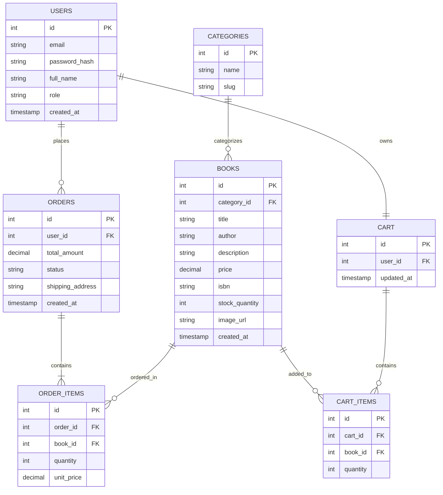

PageNest - Sprint 1

Name:BAKHTAWAR
Roll Number:2k23/CSM/30
---

# 1.Introduction

PageNest is an online bookstore where users can search, view and buy books online.

The main objective of PageNest is to provide a simple and affordable online medium for small bookstores and book sellers.
---

# 2.Target audience

Who are the primary users of our application?

Student readers General readers Book collectors Small bookstores Independent book sellers

We will provide our users with brand new and second-hand physical books.
---

# 3.Focus

What problem are we solving for our users? We focus on small bookstores and sellers who cannot afford to use expensive online marketplace solutions.

We help readers to find books by title, author, genre, price etc.
---

# 4.MVP Features

The initial features of our application will include the following:

## User authentication
Register as a user Login to the application Secure password storage Roles: Customer, Admin

## Book catalog
Browse books Search by title, author and genre View book details Filter by price, author, genre

## Book details

Title Author Description Price Stock ISBN Book image

## Shopping cart

Add items to the cart Update quantity of items in the cart Remove items from the cart View cart

## Checkout

Enter shipping address Place an order View order total (for Sprint 1, we can implement a mock checkout)

## Admin

Add books to the catalog Edit books Remove books Update stock levels
---

# 5.Technologies

The following technologies will be used to implement PageNest:

Frontend Backend Database Authentication and security Other tools React Node.js and Express.js PostgreSQL JWT (JSON Web Tokens) bcrypt.js Redis (optional, for caching)
---

# 6.Database design
The following tables will be required to store application data:

Users Categories Books Orders Order_Items Cart Cart_Items
The tables will contain the following information:

Users:
id email password_hash full_name role created_at

Categories:
id name slug

Books:
id category_id title author description price isbn stock_quantity image_url created_at

Orders:
id user_id total_amount status shipping_address created_at

Order_Items:
id order_id book_id quantity unit_price

Cart:
id user_id updated_at

Cart_Items:
id cart_id book_id quantity
---
# 7.Entity relationship
The following are the many to one and one to many relationships:
A User can have many Orders but one Order belongs to one User.
A User can have only one Cart.
An Order can contain many Order_Items.
A Book can appear in many Order_Items.
A Category can contain many Books.
A Cart can contain many Cart_Items.
A Book can appear in many Cart_Items.
## ERD Diagram

---

# 8.Project folder structure

```text
PageNest/
│
├── client/
│  └── src/
│    ├── components/
│    ├── pages/
│    ├── App.jsx
│    └── main.jsx
│
├── server/
│  ├── routes/
│  ├── db.js
│  └── server.js
│
├── database/
│  └── schema.sql
│
├── docs/
│  └── SPRINT_1.md
│
└── README.md
```
